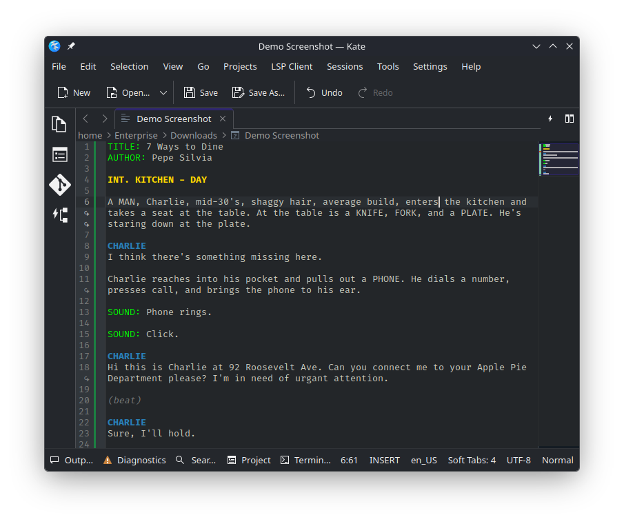

# Longhand - Fountain Syntax Highlighting for Kate


**Longhand** is a syntax highlighting definition for the [Fountain](https://fountain.io) screenwriting format, designed for the Kate text editor on Linux and Windows. Named as a tribute to the classic way of writing scripts, Longhand brings modern syntax highlighting to your screenwriting workflow.

## Features

- **Scene Headings** - Bold yellow highlighting for INT./EXT. sluglines
- **Character Names** - Blue bold text for character cues (including V.O., O.S., etc.)
- **Dialogue** - Bright blue text for character dialogue
- **Parentheticals** - Gray italic styling for actor direction
- **Transitions** - Bold purple highlighting for CUT TO:, FADE TO:, etc.
- **Actions** - Clean white text for action lines
- **Notes & Comments** - Support for [[notes]] and /* boneyard */ comments
- **Section Headings** - Support for # section markers
- **Text Formatting** - Bold (**text**), italic (*text*), and underline (_text_)
- **Custom Elements** - Green highlighting for all-caps followed by colons (MONTAGE:, FLASHBACK:, etc.)

## Preview



## Installation

### Linux (KDE Plasma)

1. Download `longhand.xml` from this repository

2. Create the syntax directory if it doesn't exist:
   ```bash
   mkdir -p ~/.local/share/org.kde.syntax-highlighting/syntax/
   ```

3. Copy the syntax file:
   ```bash
   cp longhand.xml ~/.local/share/org.kde.syntax-highlighting/syntax/
   ```

4. Restart Kate

5. Open a `.fountain` file or manually select **Tools > Highlighting > Markup > Longhand**

### Windows

1. Download `longhand.xml` from this repository

2. Navigate to your Kate installation directory, typically:
   ```
   C:\Program Files\Kate\bin\org\kde\syntaxhighlighting\syntax\
   ```

3. If the `syntax` folder doesn't exist, create it

4. Copy `longhand.xml` into the `syntax` folder

5. Alternatively, you can place it in your user directory:
   ```
   %LOCALAPPDATA%\org.kde.syntax-highlighting\syntax\
   ```

6. Restart Kate

7. Open a `.fountain` file and the syntax highlighting should activate automatically

### GNOME Text Editor

1. Download `longhand.lang` from this repository

2. Create the language specs directory:
   ```bash
   mkdir -p ~/.local/share/gtksourceview-5/language-specs/
   ```
   
   *Note: If using an older version, try `gtksourceview-4` or `gtksourceview-3`*

3. Copy the syntax file:
   ```bash
   cp longhand.lang ~/.local/share/gtksourceview-5/language-specs/
   ```

4. Restart GNOME Text Editor

5. Open a `.fountain` file and syntax highlighting will activate automatically

## About Fountain Format

Fountain is a simple markup syntax for writing, editing, and sharing screenplays in plain, human-readable text. It allows writers to work in any text editor while maintaining proper screenplay formatting.

Learn more at [fountain.io](https://fountain.io)

## Color Scheme

Longhand uses a Python-inspired color palette designed for readability and visual clarity:

- **Scene Headings**: Yellow/Gold (#FFD700)
- **Character Names**: Blue
- **Dialogue**: Bright Blue (#5dade2)
- **Transitions**: Purple
- **Parentheticals**: Gray (italic)
- **Notes/Comments**: Gray (italic)
- **Custom Elements**: Green (#00FF00)

## Symbols Sidebar

Kate users can enable the Symbols sidebar (**View > Tool Views > Symbols** or F7) to see scene headings as a navigable table of contents.

## Contributing

Contributions are welcome! If you find bugs or have suggestions for improvements, please open an issue or submit a pull request.

## License

This project is licensed under the MIT License - see the [LICENSE](LICENSE) file for details.

## Acknowledgments

- Inspired by the [Fountain](https://fountain.io) format specification
- Color scheme influenced by Python syntax highlighting
- Logo design inspired by Bazzite/Universal Blue branding
- Built for the Kate text editor community

## Support

If you encounter issues:
- Check that the XML file is in the correct directory
- Ensure the file is named exactly `longhand.xml` (not `longhand.xml.txt`)
- Verify Kate has been fully restarted after installation
- For GNOME Text Editor, confirm your GtkSourceView version

---

**Happy screenwriting!** ✍️
